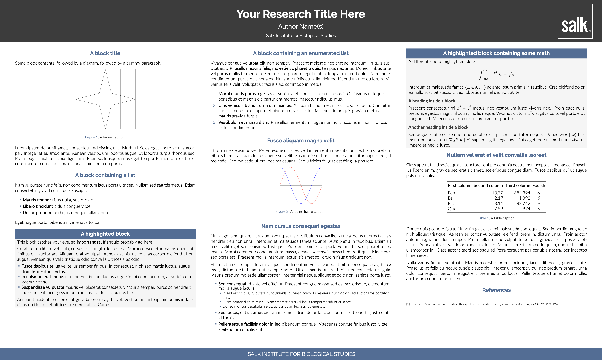

# Gemini - Salk Institute Theme

A customized [Gemini] LaTeX beamer poster theme for the [Salk Institute for Biological Studies](https://www.salk.edu/).

This theme features a clean, professional design with the Salk Institute branding and color scheme.

## Preview

## What's Different from Original Gemini?

- **Cleaner header design**: Removed diagonal blue accents for a more streamlined appearance
- **Salk Institute branding**: Custom color scheme matching Salk's brand guidelines
- **Optimized spacing**: Improved highlighted block spacing to prevent text clipping
- **Salk logo integration**: Template configured for the Salk logo

Based on the excellent [Gemini] theme by [Anish Athalye](https://github.com/anishathalye/gemini).

## Dependencies

- A TeX installation that includes [LuaTeX]
    - You also need `latexmk` if you want to use the provided `Makefile`
- LaTeX package dependencies including beamerposter (these usually come with your TeX installation, but if not, you can get them from [CTAN])
- [Raleway] and [Lato], which are both available under Open Font License

## Usage

1. Copy the files in this repository (or clone the repository)

1. In `poster.tex`, set up your paper size, column layout, and scale the content as necessary

1. The Salk theme files (`beamerthemesalk.sty` and `beamercolorthemesalk.sty`) are already configured - just customize the content

1. Run `make` to build your poster

## FAQ

See the [FAQ] in the Wiki for answers to frequently asked questions such as how to add an institution logo to the poster.

## Themes

Gemini includes several color themes, and it's also easy to make your own. Gemini has three built-in themes:

- `gemini`, default
- `mit` ([Massachusetts Institute of Technology](https://mit.edu))
- `labsix` ([LabSix](https://www.labsix.org/))

The community has also contributed a number of themes:

<!-- keep these in sorted order by theme name -->

- `bristol` ([University of Bristol](https://www.bristol.ac.uk/))
- `dart` ([Dartmouth College](https://dartmouth.edu))
- `snu` ([Seoul National University](https://snu.ac.kr))
- `stetson` ([Stetson University](https://stetson.edu))
- `umich` ([University of Michigan](https://umich.edu/))
- `warwick` ([University of Warwick](https://warwick.ac.uk/))

If you create a Gemini theme, feel free to send a pull request to add it here!

### MIT theme

### LabSix theme

## Design goals

- **Minimal**: clean and easy to read, so that the emphasis is on the content
- **Batteries included**: works and looks good out of the box
- **Easy theming**: easy to create and use a new color theme

## Contributing

Contributions to Gemini such as bug reports, new themes, and new poster components are greatly appreciated! Given the subjective nature of design, you're encouraged to open an issue or pull request early to get feedback before investing a lot of time in implementing a new feature.

## License

Copyright (c) Anish Athalye. Released under the MIT License. See [LICENSE.md][license] for details.

[Gemini]: https://github.com/anishathalye/gemini
[beamerposter]: https://github.com/deselaers/latex-beamerposter
[Auriga]: https://github.com/anishathalye/auriga
[LuaTeX]: http://www.luatex.org/
[CTAN]: https://ctan.org/
[Raleway]: https://www.fontsquirrel.com/fonts/raleway
[Lato]: https://www.fontsquirrel.com/fonts/lato
[license]: LICENSE.md
[FAQ]: https://github.com/anishathalye/gemini/wiki/FAQ
